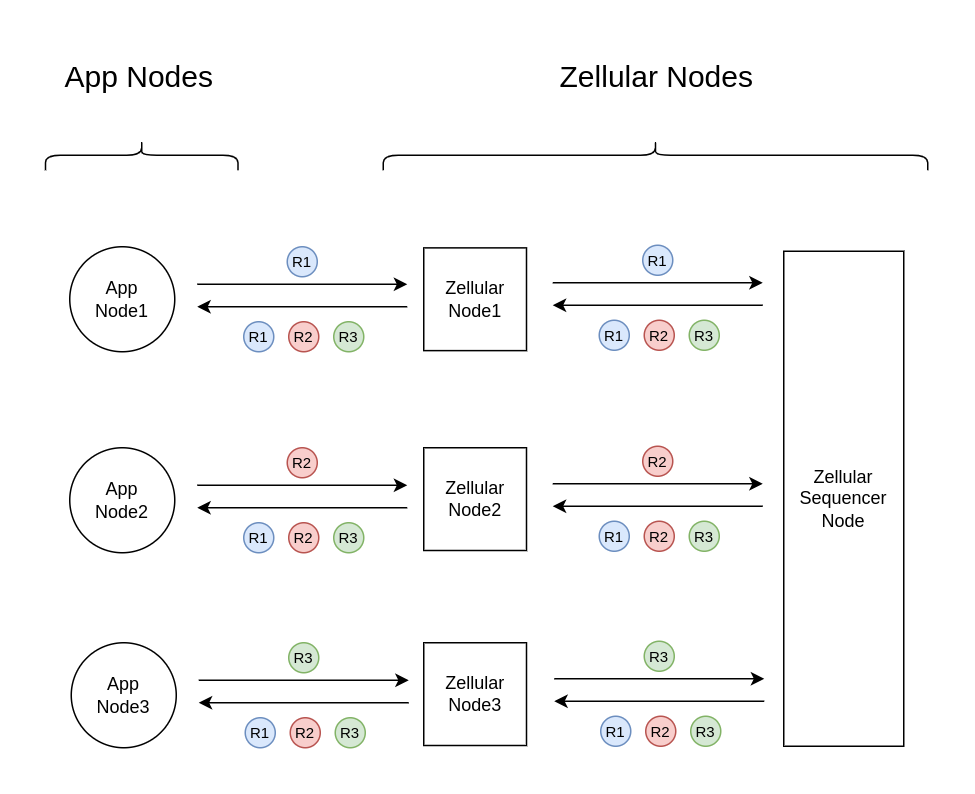
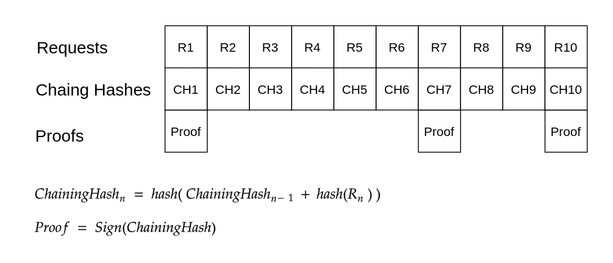

Architecture
============

dApps use Zellular as a decentralized message queue and sequencer to propagate updates across their nodes, ensuring database uniformity by applying updates in the same sequence across all nodes.

A leader node, called the Sequencer, takes the lead in ordering tasks and maintains this role as long as it functions correctly. If the Sequencer malfunctions—going offline, censoring requests, or issuing inconsistent orders—other nodes can challenge its authority. If a majority of nodes agree, the leadership role will seamlessly transfer to another node, ensuring uninterrupted operation despite failures or malicious behavior.

The Sequencer gathers and aggregates BLS signatures from all nodes to confirm they have received the same sequence of requests. Based on the `Zellular protocol </protocol.html>`_, the Sequencer should share these aggregated signatures continuously with all nodes as proof of consensus. If any node fails to receive or verify these proofs, it can initiate a dispute against the Sequencer.

To achieve better performance, consensus proofs are generated not for each individual request but for sequences of requests. Each request includes a chaining hash, which is the hash of the request body combined with the chaining hash of the previous request. The proof is a signature on this chaining hash. When nodes confirm that their chaining hash at some height matches, it indicates they have reached consensus on all preceding requests in the sequence.

These proofs are crucial not only for Zellular nodes to ensure that the Sequencer is distributing the same sequence of requests uniformly but also for app nodes using Zellular’s sequencing service. App nodes can verify that the sequence they receive is finalized and validated by a threshold of Zellular nodes, providing trustless verification. In other words, unlike traditional blockchains where you need to trust the node you're connected to, Zellular enables reading sequenced transactions without relying on a specific node's trustworthiness.
