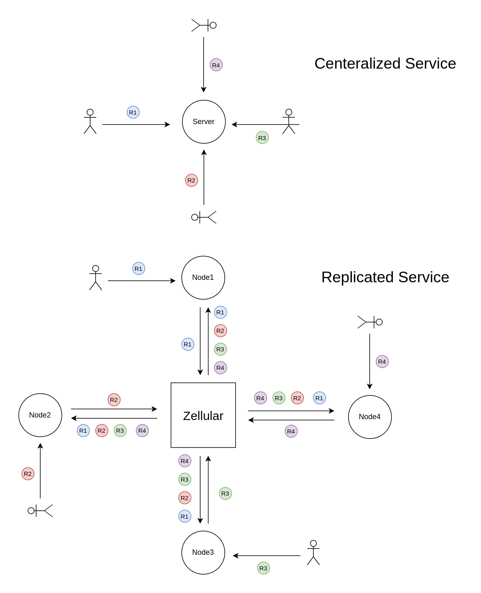

Zellular Sequencer
==================

Zellular is a decentralized sequencer that enables developing high-throughput dApps implemented in high-level languages like JS, Python, and Go. These dApps can be decentralized as `Byzantine Fault Tolerant (BFT) <https://en.wikipedia.org/wiki/Byzantine_fault>`_ services, `replicated <https://en.wikipedia.org/wiki/State_machine_replication>`_ and secured on `EigenLayer <https://www.eigenlayer.xyz/>`_ and other restaking platforms.

High-throughput dApps need to manage a large volume of user interactions, such as transactions or updates, which need to be processed quickly and consistently. In a decentralized environment, these requests are no longer directed to a single server but must be propagated across all replicas of the service in the exact same sequence to ensure consistency among the nodes. Zellular acts as a decentralized, high-performance messaging system, ensuring that updates are propagated and applied in the same order across all nodes, preserving database uniformity.

.. note::

   This project is under active development and should not be used in production yet.

.. include:: toc.rst

