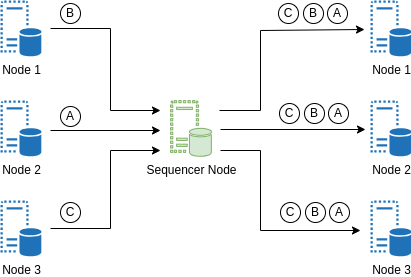

Introduction
===============

`Replicating <https://en.wikipedia.org/wiki/State_machine_replication>`_ centralised services across multiple nodes creates a decentralised system that remains robust, even if some nodes fail or act maliciously—this is the essence of `Byzantine Fault Tolerance <https://en.wikipedia.org/wiki/Byzantine_fault>`_.

The first phase in decentralizing a centralized service using this approach is to enable each node to independently verify the authenticity of the shared data. This is achieved by substituting the conventional username/password login with signature-based authentication at every place where users send their requests.

The second phase is to ensure that all replicated nodes maintain identical databases or states requires receiving and applying user-signed requests in a uniform sequence. Divergent application of updates can lead to desynchronization among nodes.

This is where the **Zellular Sequencer** comes into play. Using Zellular Sequencer, your application can receive user-signed requests consistently in the same order on all the nodes running it.

In Zellular Sequencer, one of the network nodes, the Sequencer, takes the leader role for sequencing tasks. User-signed requests received by a node are applied to the database only after being sent to the leader and received back along with other nodes’ requests in a consistent order.

If the Sequencer malfunctions—by going offline, censoring requests, or sending inconsistent orders—other nodes can challenge its actions. Should enough nodes agree, the Sequencer's role will seamlessly transfer to a new leader. This mechanism makes the Zellular Sequencer a Byzantine Fault Tolerant (BFT) service, facilitating sequencing without a single point of failure.

