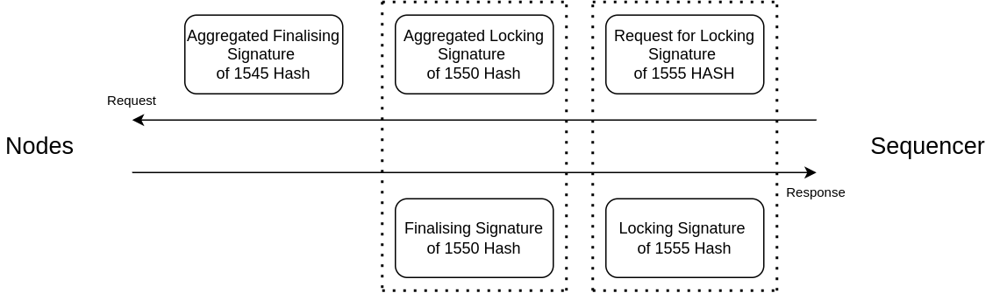

The Protocol
============

Design Principles
-----------------

We present Zellular, a leader-based Byzantine Fault Tolerant (BFT) replication protocol, with unique design principles compared to PBFT, Tendermint, and HotStuff.

No Proposer Rotation
~~~~~~~~~~~~~~~~~~~~

In other protocols, the proposer role rotates among nodes to distribute block formation tasks and incentivize participation. However, Zellular focuses on switching the sequencer only in the event of a fault, removing the need for rotation and reward distribution based on processing.

No Gossip Propagation
~~~~~~~~~~~~~~~~~~~~~

Other solutions use the Gossip protocol for transaction propagation, which lacks an upper limit on the number of rounds needed. The proposer must resend transactions to all nodes, resulting in at least ``(n + 1)`` rounds where ``n`` is at least ``1``. In contrast, Zellular eliminates the need for rotation of proposer by using a single sequencer. The node receiving the transaction sends it to the sequencer, and all nodes get the latest transactions from the sequencer upon request. This ensures transaction propagation in exactly two rounds, making the process more efficient and deterministic.

Assumptions
-----------

Zellular, like other BFT protocols, assumes that more than two-thirds of participating nodes are honest. This allows the protocol to tolerate up to one-third of nodes behaving maliciously or arbitrarily (Byzantine faults).

This assumption is critical for ensuring safety and liveness: all quorum-based steps—such as locking, finalization, and dispute resolution—require signatures from more than two-thirds of nodes.

The Workflow
------------

Posting
~~~~~~~

* **Receiving Transactions:** A node receives user transactions and sets their state to *initialised*.

* **Posting to Sequencer:** The node sends its *initialised* transactions to the Sequencer and receives a list of sequenced transactions, including its own and others', each with an index. The node updates its transactions with these indices and changes their state to *sequenced*.

* **Tracking Last Index:** Each node includes the index of the last received transaction from the Sequencer in their posts to ensure they receive only newly sequenced transactions.

* **Regular Posting:** Nodes must regularly post requests to the Sequencer, even without new transactions, to stay updated on transactions from other nodes.

Finalising
~~~~~~~~~~

* **Calculate Chaining Hash:** For each transaction with index ``n``, the node computes the chaining hash as h\ :sub:`n` = hash( h\ :sub:`n-1` + hash(tx\ :sub:`n` ) ) to ensure a consistent transaction order across all nodes.

* **Store Latest Index:** The sequencer keeps track of the latest index returned to each node after a post request.

* **Determine Syncing Point:** The sequencer periodically calculates the syncing point, the index reached by a threshold number of nodes, and requests a signature from them on the chaining hash of that index to indicate readiness to lock transactions.

* **Aggregate Locking Signatures:** Upon receiving locking signatures from the nodes, the sequencer aggregates them and sends the aggregated locking signature back to the nodes. Nodes verify and update the state of all transactions up to that index to *locked* and respond with a finalising signature.

* **Aggregate Finalising Signatures:** The sequencer aggregates the finalising signatures received from the nodes and sends the aggregated finalising signature back. Nodes then verify and update the state of all transactions up to that index to *finalised*.

* **Simultaneous Requests:** To enhance efficiency, the sequencer simultaneously requests locking signatures for a current index and finalising signatures for an older index (for which it has already received locking signatures) in each request.

Disputing
~~~~~~~~~

* **Initiating a Dispute:** A node initiates a dispute against the Sequencer if:

  * The Sequencer fails to respond, indicating it may be offline.

  * The Sequencer excludes the node's transactions, suggesting censorship.

  * The Sequencer does not update the finalisation proof within a predefined period, implying possible inconsistency in transaction orders.

* **Sharing Evidence:** The node shares the problematic transactions with other nodes and collects their signatures to confirm the Sequencer's malfunction.

* **Triggering a Switch:** If the threshold number of nodes confirms the issue, the node sends the collected signatures to all nodes to initiate the switching process.

Switching
~~~~~~~~~

* **Resetting Transactions:** Upon receiving a switch request, nodes reset all *sequenced* transactions to *initialised*, but **preserve locked and finalized batches**.

* **State Synchronization:** All nodes query peers for their latest *finalized* and *locked* transactions and sync to the highest known state before connecting to the new Sequencer.

Security Justifications
-----------------------

Why must more than 2/3 of nodes be honest?
~~~~~~~~~~~~~~~~~~~~~~~~~~~~~~~~~~~~~~~~~~

Zellular requires more than two-thirds of nodes to be honest to prevent conflicting locking or finalization proofs.

For example, in a 7-node network:

- A valid proof requires signatures from at least 5 nodes (>2/3).
- If 3 nodes are Byzantine, they can behave maliciously and sign two different values.
- They can send one value to 2 honest nodes (e.g., nodes A and B) and another value to a different 2 honest nodes (e.g., nodes C and D).
- In each case, the 3 Byzantine nodes combine their signatures with those of the 2 honest nodes to create a valid-looking proof of 5 signatures.
- These two conflicting proofs — each with 5 valid signatures — can finalize different transaction sequences.

This breaks the protocol’s consistency guarantees, as different honest nodes could accept conflicting finalizations.

By limiting faults to fewer than one-third of the nodes, any quorum of more than two-thirds will always overlap with at least one honest node. Since honest nodes never sign conflicting data, this overlap ensures that no two conflicting proofs can be formed, preserving the protocol’s safety.

Why is locking required before finalization?
~~~~~~~~~~~~~~~~~~~~~~~~~~~~~~~~~~~~~~~~~~~~

Without a locking step, a Byzantine sequencer can exploit the finalization process:

1. It collects finalization signatures from nodes for a sequence of batches.
2. It withholds the finalization proof from the rest of the network.
3. It then crashes or becomes unresponsive, triggering a leader switch.
4. Honest nodes, unaware that the sequence was finalized, roll back their sequenced state and finalize a different sequence of batches under the new leader.
5. If the original sequencer had already shared the first finalization proof externally (e.g., with applications), two conflicting finalization proofs now exist for the same index.

This violates the core guarantee that finalization is unique and irreversible.

The locking step prevents this by enforcing the following:

- Nodes first `lock` on a specific chaining hash that commits to a sequence of batches at a given index.
- Only after more than 2/3 of nodes have locked can the sequencer request finalization signatures.
- If a Byzantine sequencer withholds the locking proof, it cannot proceed to finalization — so no conflicting finalization is possible.
- If it does complete finalization, the locked sequence is already shared across the network, and the next leader will be required to continue from that point.

Locking serves as a network-wide commitment checkpoint, ensuring that only one version of a sequence of batches can ever be finalized — even in the presence of a malicious sequencer.

Why must locked transactions be preserved across sequencer switches?
~~~~~~~~~~~~~~~~~~~~~~~~~~~~~~~~~~~~~~~~~~~~~~~~~~~~~~~~~~~~~~~~~~~~~~

During a sequencer switch, nodes reset all *sequenced* transactions to the `initialized` state. However, they must **preserve locked transactions**, just like finalized ones.

If nodes drop their locked state during the switch, it creates a critical vulnerability:

1. A malicious sequencer may have already gathered enough finalization signatures for a locked sequence but withheld the finalization proof from the rest of the network.
2. Honest nodes, unaware of this, discard their locked state and proceed with a new sequencer.
3. The new honest sequencer generates a different sequence, reaches quorum, and produces a new finalization proof for the same index.
4. Now, two conflicting finalization proofs exist for the same batch index — violating safety and breaking the guarantee of finalization uniqueness.

The entire purpose of the locking step is to act as a **durable pre-finalization commitment**, especially across leader changes. If it's discarded during a switch, it no longer serves that role.

Why can't only the new leader sync state after a switch?
~~~~~~~~~~~~~~~~~~~~~~~~~~~~~~~~~~~~~~~~~~~~~~~~~~~~~~~~

During a sequencer switch, it's not enough for only the new leader to query peers for the latest state. All nodes must independently query for both the latest *finalized* and *locked* batches, and sync to the highest known indices before proceeding with the new leader.

If nodes discard their sequenced state during a switch and rely solely on the new sequencer to establish the next locked sequence, a liveness vulnerability arises — especially under successive malicious sequencers.

**Example scenario (7-node network with 5 honest and 2 malicious nodes):**

1. A malicious sequencer creates a valid sequence and collects locking signatures from 5 nodes — the required >2/3 quorum.
2. It then shares the locking proof with only 2 honest nodes and hides it from the other 3.
3. In the next switch, a second malicious sequencer creates a different sequence and collects a new locking signature from the other 3 honest nodes — again forming a quorum of 5, but with a different subset.
4. Now, the network is split:
   - 2 honest nodes are locked on sequence A.
   - 3 honest nodes are locked on conflicting sequence B.
5. Neither sequence has enough honest overlap to reach the 5-of-7 threshold needed for finalization.

As a result, both views are locked but incompatible — and **no future sequencer can gather enough signatures to finalize either one**, leading to a permanent stall in the protocol. Liveness is lost.

To prevent this before accepting a new sequencer, each node should sync to the highest known locked index, just as they do for finalized data. This ensures that any valid locking signature held by even one honest node can be propagated across the network, allowing honest nodes to finalize and preventing split-lock deadlocks.